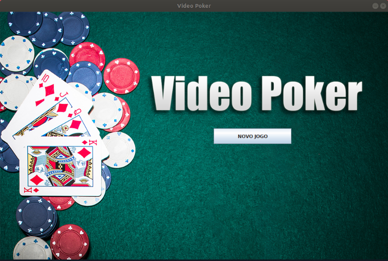
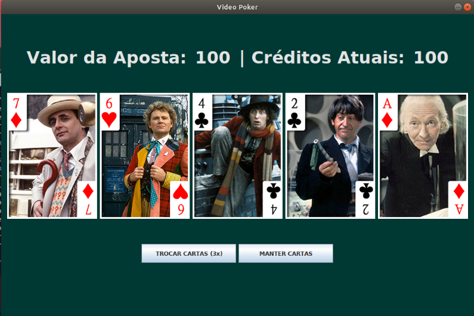

# Poker Who?

Jogo de Video Poker utilizando a temática de Doctor Who realizado para a disciplina de **SSC0103 - Programação Orientada a Objetos**.

### Estrutura dos Arquivos

```
VideoPoker/        - Pasta raíz do projeto.
| -- bin/          - Arquivos Java compilados.
| -- src/          - Código Fonte do projeto.
| -- resources/    - Imagens utilizadas na GUI.
| -- pokerwho.jar  - Executável do projeto.
```

### Como Executar?

O executável final do projeto se encontra na pasta `VideoPoker` e pode ser executado via CLI por meio do comando `$ pokerwho.jar`.

### Autores

Gabriel Van Loon & Alberto Campos Neves.

### Telas do Programa




